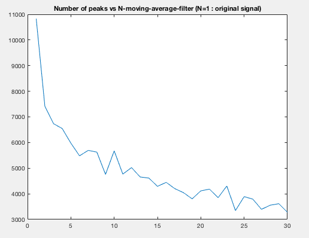
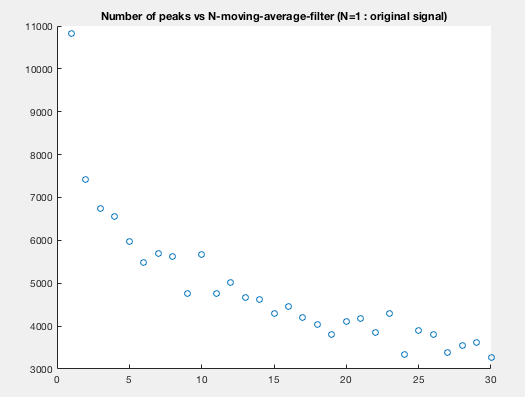
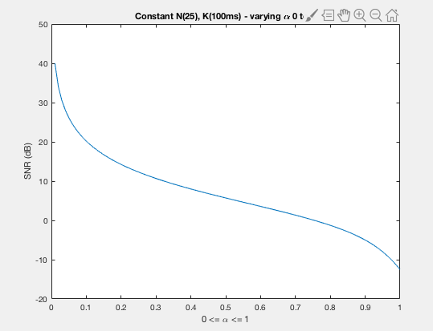
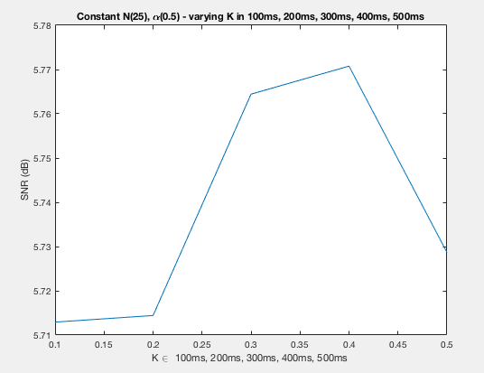

## CMPE 362 - 2019 - HW2 REPORT - HALIT OZSOY - 2016400141

For more details, see the source files in the src folder

### AdvancedPeakFilter
* Learned to make moving average filter and how it affects the peaks.

#### Interpretation
* Increasing the N value in a moving average filter overall decreases the number of local peaks.
* Can be used for normalizing signal at the cost of losing high spatial signal details.

\
\
\
&nbsp;

#### Problem 2
* Learned about how to manipulate frequency & speed & pitch of a sampled sound.

\
\
\
\
\
\
&nbsp;

#### NTapFilter
* Learned to make an NTapFilter and how its parameters affects SNR values of the rescued signal.
* Learned to write a MatLab function file

#### Interpretations
* From noisy signals better signals can be rescued via ntapfilter.
* However, if used meaningless parameters the rescued signal is usually worse.
* If N or K is too much the sound echoes, too much.
* If alpha is too much, the sound becomes not understandable at all.
* For best, use small N (~5), K (~0.1) and alpha (~0.1)

