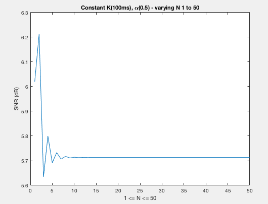

## CMPE 362 - 2019 - HW2 REPORT - HALIT OZSOY - 2016400141

For more details, see the source files in the src folder

#### AdvancedPeakFilter
* Learned to make moving average filter and how it affects the peaks.

\
\
\
&nbsp;

#### Problem 2
* Learned about how to manipulate frequency & speed & pitch of a sampled sound.

\
\
\
\
\
\
&nbsp;

#### Problem 3
* Learned to make an NTapFilter and how its parameters affects SNR values of the rescued signal.
* Learned to write a MatLab function file

