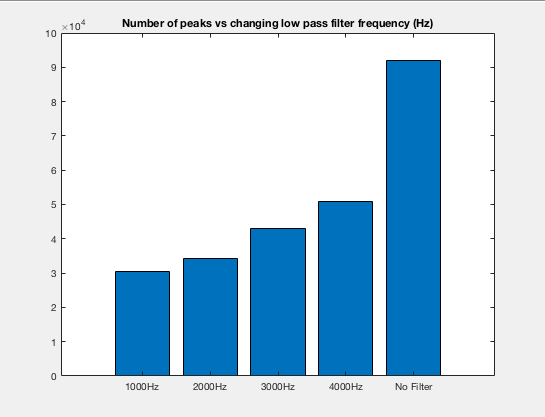
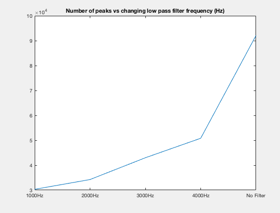
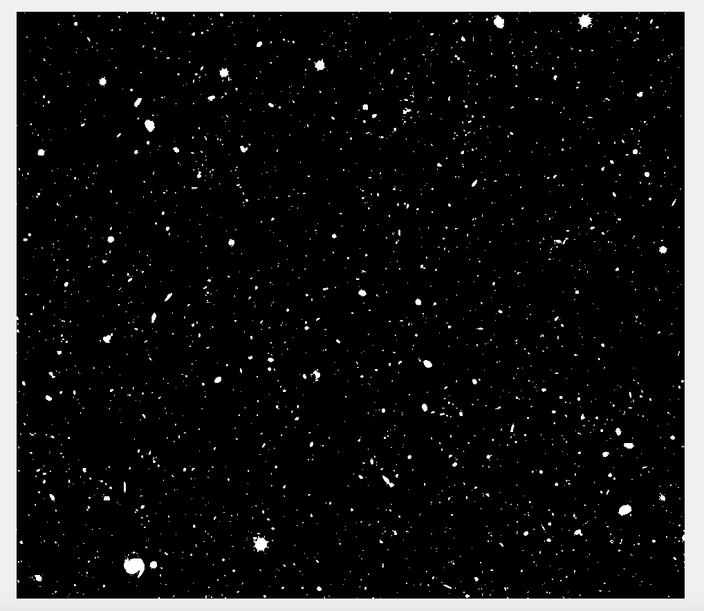
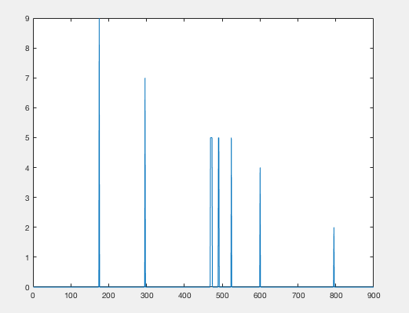

## CMPE 362 - 2019 - HW3 REPORT - HALIT OZSOY - 2016400141

For more details, see the source files in the src folder

### AdvancedPeakFilter

#### Learnings & Thoughts

* Revised my MATLAB knowledge of applying filters & finding peaks and making interpretations 
by observing the change in the number of peaks depending on a variable

#### Source Code `src/AdvancedPeakFreqFilter.m`

* Read and play the original sound
```matlab
% related audio (signal) file is at path "../ProvidedFiles/PinkPanther30.wav"
fpath = "../ProvidedFiles/PinkPanther30.wav";
[y, Fs] = audioread(fpath);
% y is the original sample matrix, Fs is the sampling rate

duration = numel(y) / Fs; % calculate the duration

sound(y, Fs);         % Play the original sound
disp("Playing the original sound");
pause(duration + 1); % Wait for the sound to finish
```

<div style="page-break-after: always;"></div>

* Count the number of peaks in the original sound
```matlab
peakCounts = nan(1, 5);
% peakCounts 1-4 are nof peaks in filtered sound
% 5th one is the nof peaks in the original sound
% Calculate nof peaks in the original sound
peaks = findpeaks(y);
% peaks in the original sound

nofPeaks = numel(peaks);
% number of peaks in the filtered sound

peakCounts(5) =  nofPeaks;
% set the last result to the nofPeaks of original sound
```

* Filter the sound with low pass filters of 4-3-2-1KHz, 
count the number of peaks in the filtered sound, play the filtered sound

```matlab
for N=4:-1:1
    % Find low pass filtered signals, play them and find their peak counts.
    % 1 => 1KHz, 2 => 2 KHz, 3 => 3KHz, 4 => 4KHz
    filtered = lowpass(y, N * 1000, Fs);
    % filtered sound

    sound(filtered, Fs);       % Play the filtered sound
    disp(strcat("Playing the sound filtered by a low pass filter of ", num2str(N), "KHz"));
    pause(duration + 1); % Wait for the sound to finish

    peaks = findpeaks(filtered);
    % peaks in the filtered sound

    nofPeaks = numel(peaks);
    % number of peaks in the filtered sound

    peakCounts(N) = nofPeaks;
    % set Nth result to the found nofPeaks
end
```

<div style="page-break-after: always;"></div>

* Define X-Labels for the sound (manually defined since there's a No-Filter version) 
```matlab
labels = {"1000Hz", "2000Hz", "3000Hz", "4000Hz", "No Filter"};
% first 4 values are the applied filters 1000Hz, 2000Hz, 3000Hz, 4000Hz
% last one is for no filter (original sound)
```

* Generate a Bar Chart to compare the number of peaks vs filter frequency, 
then, pause and request pressing a key to continue.

```matlab
fig = figure();
set(fig, 'Name', 'Bar');

bar(peakCounts);
xticklabels(labels);
title('Number of peaks vs changing low pass filter frequency (Hz)');


disp('Press a key to move on to line plot version')
pause;
close(fig)
```

* Generate a Line Plot to compare the number of peaks vs filter frequency,
then, pause and request pressing a key to finish.

```matlab
fig = figure();
set(fig, 'Name', 'Line Plot');

plot(peakCounts);
title('Number of peaks vs changing low pass filter frequency (Hz)');
xticks(1:5);
xticklabels(labels);

disp('Press a key to close the figure & finish')
pause;
close(fig)
```
<div style="page-break-after: always;"></div>

#### Generated Plots





<div style="page-break-after: always;"></div>

#### Interpretation

* Decreasing the frequency of the low pass filter, filters the data further by trimming more frequencies.
* Doing so decreases the number of peaks found.
* The rate of the number of peaks found decreases almost linearly as the filter frequency is decreased.
* Change between 4000Hz and No-Filter is not linear on line chart as expected, since the change in filtered 
frequency is not linear but it can be thought as the filter frequency goes from 4000 to Infinity, however, 
that's not exactly true since the existing frequencies are limited due to not having perfect sampling equipment
and it does not make sense to sample every possible frequency in real life anyways since we won't be able to hear.
* Let's assume that the no-filter value corresponds to a filter of around 8KHz, which would still justify our observation 
that the number of peaks changes almost linearly as the filter frequency changes.     
* Such situation makes sense, since as the filter frequency gets lower, more high frequencies that were probably local peaks
are trimmed resulting in less peaks observed.

<div style="page-break-after: always;"></div>

### Converting a Hubble Deep Space Image Into Space Sound

#### Learnings & Thoughts

* The whole idea of playing an image as a sound is very exciting.
* I have learned how to convert an image into black & white, see it as a 
frequency-list to generate a sound from it using Inverse Fourier Transform
* Applying my abstract knowledge of Fourier Transform & Inverse Fourier Transform
to a real life situation made my mind clearer about these transforms and how to use them.
* I was fascinated by seeing how MATLAB can accomplish such high level functions so easily.


#### Source Code `src/SonifiedDeepSpace.m`

* Read the source image and convert it to black & white (use default binarize method for determining black-white thresholds)
* Commented out `imshow` is used to verify the converted black & white image. 
```matlab
% image path is "../ProvidedFiles/Hubble-Massive-Panorama.png"
rawImageData = imread("../ProvidedFiles/Hubble-Massive-Panorama.png");

grayImageData = rgb2gray(rawImageData);
% convert image to grayscale first
bwImageData = imbinarize(grayImageData);
% convert image to black and white

% imshow(bwImageData);
```
<div style="page-break-after: always;"></div>

* Flip the data upside down since the requirements in description are 
all for bottom to up whereas MATLAB indexes from top to bottom. 
```matlab
flippedImgData = flipud(bwImageData);
% since from bottom to top each pixel corresponds to 1-900Hz as their index
% from bottom, flip the image matrix up-down to reverse that order so that
% fourier transforms work as expected, (input for ifft resembles amplitudes
% for each frequency but each index of a vector means the frequency where
% the index is increasing from top to bottom unlike the project
% description where the index resembles frequency but increasing from
% bottom to top. That's why it was flipped up-down)

% From now on, since the data is flipped, top to bottom each pixel
% resembles its index Hz.
% Similarly amplitude parting should be reversed, from top to bottom parts
% have decreasing amplitude
```

* Create an amplitude column and multiply each column to satisfy requirement
about dividing each column to 10 and giving amplitudes from 1 to 10 for each part.
```matlab
amplitudes = transpose(repelem(10:-1:1, 90));
% divide each column (900 pixels) to 10 parts (90 pixel each)
% starting from the top, parts have amplitude 10, 9, 8, ..., 2, 1
% so repeat the vector 10:-1:1 elements 90 times (90 times each element for each pixel in the related part)
% Transposed to convert the row vector to column vector

freqData = bwImageData .* amplitudes;
% multiply each column with the given amplitudes
```

<div style="page-break-after: always;"></div>

* Determine a sampling rate, it must be at least 900Hz to not to lose any data, 
and 1000Hz to be playable on my audio device.
* Commented out plot is to test the given input for the first column data.
```matlab
% Sampling Rate (Frequency in Hz)
Fs = 1000;
% Since each column has a length,frequencies from 1 to 900Hz require
% sampling frequency >= 900
% Since the audio device on my computer supports playing at lowest 1000Hz,
% Thus, I've chosen Fs as 1000 Hz.

% plot(1:900, freqData(:, 1))
``` 

* Apply Inverse Fourier Transform to each column (ifft function applies it to each column) 
to obtain audio sample data from given frequencies (convert frequency domain to time domain)  
```matlab
soundData = ifft(freqData, Fs);
% ifft zero-pads the data if the Fs is bigger than the original matrix
% which is the case since Fs=1000>900, so the output data would have
% columns of size 1000 (1024 columns each of size 1000)
% each column resembles 1000 samples with sampling rate 1000 (1 second)
```

* Concat each column (each column represent 1 second of data) to obtain the full sound.
* Take absolute value of each data so that they are real and playable.
```matlab
soundData = reshape(soundData, numel(soundData), 1);
% Concat each of these columns to obtain 1024 seconds of sound.

soundData = abs(soundData);
% Take the absolute value of each data to get real numbers to play for real
```

<div style="page-break-after: always;"></div>

* Optionally save the created `wav` sound data, to play outside MATLAB, 
if not wanted, you can uncomment this line.
```matlab
audiowrite("../CreatedAudio/SonifiedDeepSpace.wav", soundData, Fs);
% Save the created wav file
```

* Calculate the total duration, should be 1024 seconds, but still calculate 
it to make it less dependent to the input image.
```matlab
duration = length(soundData) / Fs;
% Total Duration of the sound
```

* Start playing the generated sound
```matlab
sound(soundData, Fs);
% Start Playing the sound generated
```

* Optionally display the remaining time of the playing sound, since it is long (1024 seconds ~ 17 minutes)
after each percentage of the sound is played. If not desired, remove the below lines.
```matlab
% Fancy remeaning duration displayer with pauses
disp(strcat("Playing the sound obtained"));
for N = 0:1/100:1
    % For each percantage of the sound played display remaining duration
    leftDuration = duration * (1-N);
    % Calculate remaining duraion
    disp(strcat(num2str(100 * N), "% =>  ", num2str(leftDuration), " seconds left until sound finishes ..."))
    % Display it
    pause(duration/100);
    % Wait for another percentage of duration until next print.
end
disp("Sound is Finished!");
```

<div style="page-break-after: always;"></div>

#### Generated Files

* The image obtained by uncommenting `line 9`, which is the black & white converted version of the image.



<div style="page-break-after: always;"></div>

* The plot obtained by uncommenting `line 41`, which is the frequency domain spectrum 
of the first second (first column data).
* X-axis corresponds to frequency in Hz whereas Y axis corresponds to amplitude in dB.
 


* [Generated Sound File `SonifiedDeepSpace.wav`](../CreatedAudio/SonifiedDeepSpace.wav)

<div style="page-break-after: always;"></div>

#### Interpretations

* Listening to the generated audio file while viewing the original image as well as checking the current percentage,
a long (~10 seconds) medium frequency (~850 Hz) sound can be heard in background when one of the big celestial bodies close to 
bottom are hit. Otherwise, they usually feel like randomly distributed low frequency sounds of those other small celestial bodies.

* An image can be converted to black & white to resemble frequency distributions of a sound. 
And by applying Inverse Fourier Transform, these distributions can be converted to 
time-domain to generate a real and meaningful sound. 

* Unlike my initial thought, the outcome sound is very exciting. 
