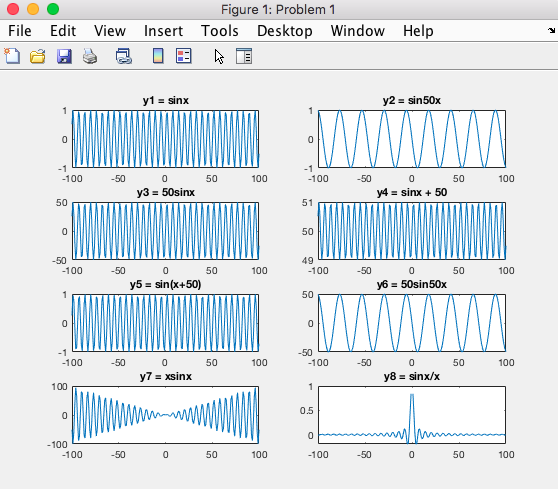
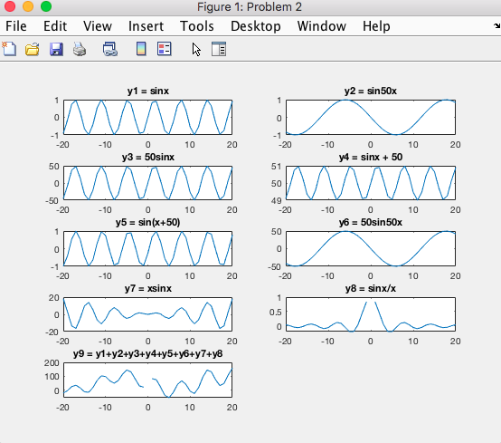
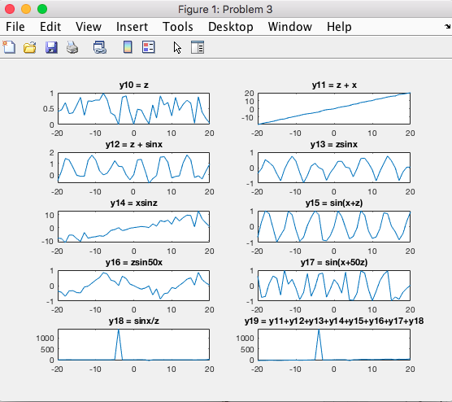
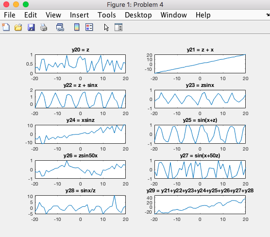
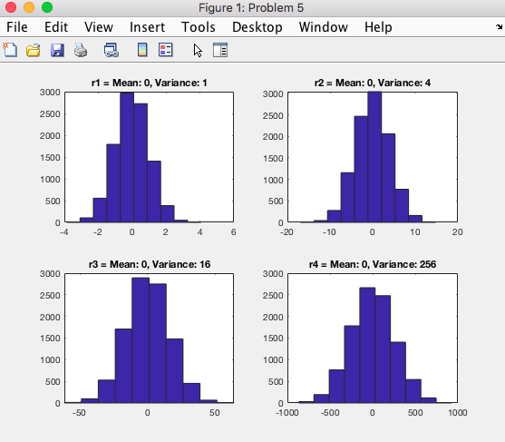
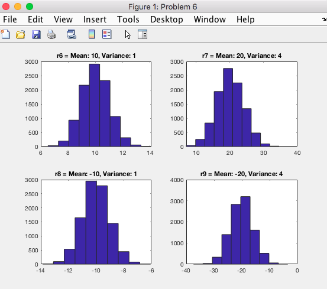
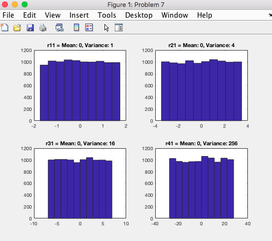
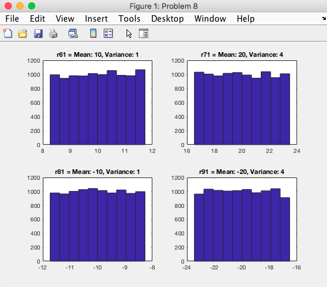

## CMPE 362 - 2019 - HW1 REPORT - HALIT OZSOY - 2016400141

### My Learnings

#### Problems 1 - 4
* Learned to make MATLAB plots / subplots.
* Learned to make and use vectors/matrices.
* Got an idea how some of the trigonometric signals look like, and also how they look like when combined.

#### Problems 5 - 8
* Figured out how to represent any distribution in MATLAB vectors and analyze them.
* Reinvented the wheel (the formula) for generating random variables (normal/uniform) by a given mean & variance.
* Got an idea how using histograms can help understand the functions/shape of a distribution.

\
\
\
\
\
\
\
&nbsp;

### Challenges I faced
* At first, I did not realize there are more than one `rand` function. 
So, while I was digging around the help page, that I realized there were `randn`, `rand` and `randi` 
all specialized for a purpose. I think this is very interesting because in most of the languages 
randomization is only used for picking out one random variable at a time and are always generated 
via the uniform random function, aka `rand`.
* At first, I tried to look for a MATLAB function for putting in mean and variance, found that there are such functions, 
but they did require an external MATLAB toolbox. Then, I realized that we're probably expected to do it via hand, 
(convert the random variables via a hand written formula to the given mean & variances) so I calculated the formulas, 
and done it that way. 
 
 
 \
 \
 \
 \
 \
 \
 \
 \
 \
 \
 &nbsp;

### Advantages & Disadvantages of MATLAB

#### Advantages
* Working and using vectors, distribution, matrices are unbelievably easy compared to any standard imperative language.
* All the operations on matrices are extremely fast compared to other languages with usual ways of doing these operations
* There are lots of functions that come built-in for vectors & matrices, whereas most other languages require us to 
work variable by variable.
* The language is very high-level, so that there's no need to write lots of lines of code for most functionality.
* Great for image manipulation since it is also represented as matrices.

#### Disadvantages
* Not an open-source platform, and it requires a subscription to use.
* There are tons of built-in functions so it may be hard to remember them all even though they have fine documentations.
* Mostly specialized for working on data science so using MATLAB for any other purpose, for example making a website or
 a small app, is not sensible or possibly possible.

\
&nbsp;

### Problems & Codes & Figures

#### Problem 1
```matlab
x = -100:100;
y1 = sin(x);
y2 = sin(50 * x);
y3 = 50 * sin(x);
y4 = sin(x) + 50;
y5 = sin(x + 50);
y6 = 50 * sin(50 * x);
y7 = x .* sin(x);
y8 = sin(x) ./ x;
 
 
subplot(4, 2, 1);plot(x, y1);title('y1 = sinx');
subplot(4, 2, 2);plot(x, y2);title('y2 = sin50x');
subplot(4, 2, 3);plot(x, y3);title('y3 = 50sinx');
subplot(4, 2, 4);plot(x, y4);title('y4 = sinx + 50');
subplot(4, 2, 5);plot(x, y5);title('y5 = sin(x+50)');
subplot(4, 2, 6);plot(x, y6);title('y6 = 50sin50x');
subplot(4, 2, 7);plot(x, y7);title('y7 = xsinx');
subplot(4, 2, 8);plot(x, y8);title('y8 = sinx/x');
```



#### Problem 2
```matlab
x = -20:20;
y1 = sin(x);
y2 = sin(50 * x);
y3 = 50 * sin(x);
y4 = sin(x) + 50;
y5 = sin(x + 50);
y6 = 50 * sin(50 * x);
y7 = x .* sin(x);
y8 = sin(x) ./ x;
y9 = y1 + y2 + y3 + y4 + y5 + y6 + y7 + y8;
subplot(5, 2, 1);plot(x, y1);title('y1 = sinx');
subplot(5, 2, 2);plot(x, y2);title('y2 = sin50x');
subplot(5, 2, 3);plot(x, y3);title('y3 = 50sinx');
subplot(5, 2, 4);plot(x, y4);title('y4 = sinx + 50');
subplot(5, 2, 5);plot(x, y5);title('y5 = sin(x+50)');
subplot(5, 2, 6);plot(x, y6);title('y6 = 50sin50x');
subplot(5, 2, 7);plot(x, y7);title('y7 = xsinx');
subplot(5, 2, 8);plot(x, y8);title('y8 = sinx/x');
subplot(5, 2, 9);plot(x, y9);title('y9 = y1+y2+y3+y4+y5+y6+y7+y8');
```



\
&nbsp;

#### Problem 3
```matlab
x = -20:20;
z = rand(1, 41);
y10 = z;
y11 = z + x;
y12 = z + sin(x);
y13 = z .* sin(x);
y14 = x .* sin(z);
y15 = sin(x + z);
y16 = z .* sin(50 * x);
y17 = sin(x + 50 * z);
y18 = sin(x) ./ z;
y19 = y11 + y12 + y13 + y14 + y15 + y16 + y17 + y18;
subplot(5, 2, 1);plot(x, y10);title('y10 = z');
subplot(5, 2, 2);plot(x, y11);title('y11 = z + x');
subplot(5, 2, 3);plot(x, y12);title('y12 = z + sinx');
subplot(5, 2, 4);plot(x, y13);title('y13 = zsinx');
subplot(5, 2, 5);plot(x, y14);title('y14 = xsinz');
subplot(5, 2, 6);plot(x, y15);title('y15 = sin(x+z)');
subplot(5, 2, 7);plot(x, y16);title('y16 = zsin50x');
subplot(5, 2, 8);plot(x, y17);title('y17 = sin(x+50z)');
subplot(5, 2, 9);plot(x, y18);title('y18 = sinx/z');
subplot(5, 2, 10);plot(x, y19);title('y19 = y11 + ... + y18');
```


#### Problem 4
```matlab
x = -20:20;
z = rand(1, 41);
y20 = z;
y21 = z + x;
y22 = z + sin(x);
y23 = z .* sin(x);
y24 = x .* sin(z);
y25 = sin(x + z);
y26 = z .* sin(50 * x);
y27 = sin(x + 50 * z);
y28 = sin(x) ./ z;
y29 = y21 + y22 + y23 + y24 + y25 + y26 + y27 + y28;
subplot(5, 2, 1);plot(x, y20);title('y20 = z');
subplot(5, 2, 2);plot(x, y21);title('y21 = z + x');
subplot(5, 2, 3);plot(x, y22);title('y22 = z + sinx');
subplot(5, 2, 4);plot(x, y23);title('y23 = zsinx');
subplot(5, 2, 5);plot(x, y24);title('y24 = xsinz');
subplot(5, 2, 6);plot(x, y25);title('y25 = sin(x+z)');
subplot(5, 2, 7);plot(x, y26);title('y26 = zsin50x');
subplot(5, 2, 8);plot(x, y27);title('y27 = sin(x+50z)');
subplot(5, 2, 9);plot(x, y28);title('y28 = sinx/z');
subplot(5, 2, 10);plot(x, y29);title('y29 = y21 + ... + y28');
```



#### Problem 5
```matlab
% N(a, b) (a: mean, b: variance)
% (N - a) / b = Z
% N = Z * b + a
% N(mean, variance) = Z * variance + mean
r1 = randn(1, 10000) * 1 + 0;
r2 = randn(1, 10000) * 4 + 0;
r3 = randn(1, 10000) * 16 + 0;
r4 = randn(1, 10000) * 256 + 0;

subplot(2, 2, 1);hist(r1);title('r1 = Mean: 0, Variance: 1');
subplot(2, 2, 2);hist(r2);title('r2 = Mean: 0, Variance: 4');
subplot(2, 2, 3);hist(r3);title('r3 = Mean: 0, Variance: 16');
subplot(2, 2, 4);hist(r4);title('r4 = Mean: 0, Variance: 256');
```



\
\
\
\
&nbsp;

#### Problem 6
```matlab
r6 = randn(1, 10000) * 1 + 10;
r7 = randn(1, 10000) * 4 + 20;
r8 = randn(1, 10000) * 1 - 10;
r9 = randn(1, 10000) * 4 - 20;

subplot(2, 2, 1);hist(r6);title('r6 = Mean: 10, Variance: 1');
subplot(2, 2, 2);hist(r7);title('r7 = Mean: 20, Variance: 4');
subplot(2, 2, 3);hist(r8);title('r8 = Mean: -10, Variance: 1');
subplot(2, 2, 4);hist(r9);title('r9 = Mean: -20, Variance: 4');
```




\
\
\
\
\
\
\
&nbsp;

#### Problem 7
```matlab
% X(a, b) (a: left end, b: right end)
% X(a, b) = X(0, 1) * (b - a) + a
% X(a, b) => mean: (a + b) / 2
%         => variance: (b - a)^2 / 12
% +-2sqrt(3variance) = b - a
% since always b > a => b-a > 0 =>
% 2sqrt(3variance) = b - a
% 2 * mean = a + b
% mean - sqrt(3variance) = a
% X(a, b) = X(0, 1) * (2sqrt(3variance)) + (mean - sqrt(3variance))
r11 = rand(1, 10000) * (2*sqrt(3*1)) + (0 - sqrt(3*1));
r21 = rand(1, 10000) * (2*sqrt(3*4)) + (0 - sqrt(3*4));
r31 = rand(1, 10000) * (2*sqrt(3*16)) + (0 - sqrt(3*16));
r41 = rand(1, 10000) * (2*sqrt(3*256)) + (0 - sqrt(3*256));

subplot(2, 2, 1);hist(r11);title('r11 = Mean: 0, Variance: 1');
subplot(2, 2, 2);hist(r21);title('r21 = Mean: 0, Variance: 4');
subplot(2, 2, 3);hist(r31);title('r31 = Mean: 0, Variance: 16');
subplot(2, 2, 4);hist(r41);title('r41 = Mean: 0, Variance: 256');
```



\
&nbsp;
#### Problem 8
```matlab
r61 = rand(1, 10000) * (2*sqrt(3*1)) + (10 - sqrt(3*1));
r71 = rand(1, 10000) * (2*sqrt(3*4)) + (20 - sqrt(3*4));
r81 = rand(1, 10000) * (2*sqrt(3*1)) + (-10 - sqrt(3*1));
r91 = rand(1, 10000) * (2*sqrt(3*4)) + (-20 - sqrt(3*4));

subplot(2, 2, 1);hist(r61);title('r61 = Mean: 10, Variance: 1');
subplot(2, 2, 2);hist(r71);title('r71 = Mean: 20, Variance: 4');
subplot(2, 2, 3);hist(r81);title('r81 = Mean: -10, Variance: 1');
subplot(2, 2, 4);hist(r91);title('r91 = Mean: -20, Variance: 4');
```


